replace
<!-- more -->

# SVM/SVR-机器学习实验报告

## 1. 任务描述

采用什么方法实现一个什么样的任务? 解决了什么问题?

1. 基于MNIST数据集, 设计和实现了一套分类器系统, 包括线性SVM和非线性SVM.

> Based on the MNIST dataset, design and implement classifiers including: linear & nonlinear SVM. 

2. 设计一套回归系统, 包括SVR(支持向量回归)的算法.

> Design a regression system to predict housing prices. The data are available at: https://www.kaggle.com/vikrishnan/boston-house-prices (also available at Sklearn). The regression algorithms should contain SVR.

## 2. 数据集描述

采用何种数据集开展实验？

- MNIST: https://www.kaggle.com/competitions/digit-recognizer
- Boston Prices: https://www.kaggle.com/vikrishnan/boston-house-prices

- 第一个实验是基于了手写数字-MNIST数据集
- 第二个实验则是基于波士顿房价数据集

数据集有什么特点？

1. MNIST-手写数字数据集

- 每一张图片都是28 * 28大小的标准图片
- 数据集合的大小比较大, 有42000张手写数字的图片; 测试集合也有28000张
- 数据集合中每种数字的分布比较的均匀

数据集的各项统计量是多少？
- 数据集大小：42000张28*28的数字灰度图片；
- 数据集参数数量：每一张图片的大小都是28*28，数字范围0-9，总计42000个输入训练样本。
- 训练样本中数字的具体的分布如下：

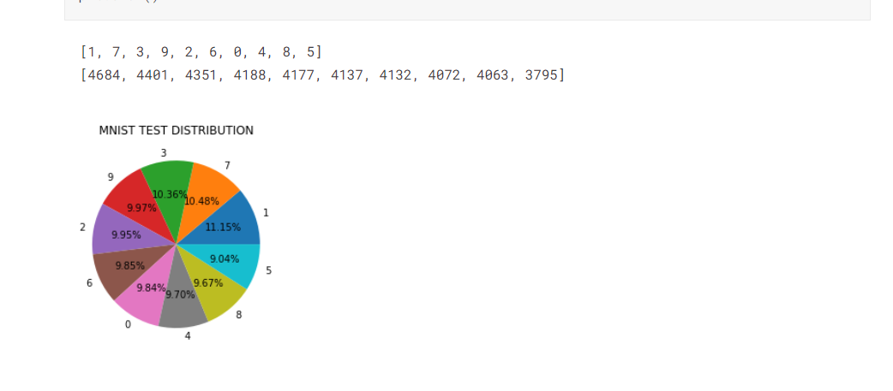

2. Boston Standard Metropolitan Statistical Area (SMSA) in 1970.
- 数据标签的维度很多（包括了是否沿河？教育资源水平，税收，交通，房屋的新旧等等各种可能的影响因素）

- 数据量小（总量只有506行），而且可能数据的年代比较久远了
- 数据的特点：以下是数据集的热力图，可以看出有一些列之间的相关度很高，比如TAX和RAD这两个指标几乎就是完全相关的（所以后续也有消除这些相关重复的尝试）

数据集的各项统计量是多少？

- 数据集大小：506行数据
- 数据集参数数量：11个输入参数，1个输出参数（价格中位数）
- CRIM（犯罪率），CHAS（是否沿河），AGE（房屋年龄）等等......
- 数据集各项的单位都不一致，有bool类型，有实数类型，有百分比，千等等不同的单位 

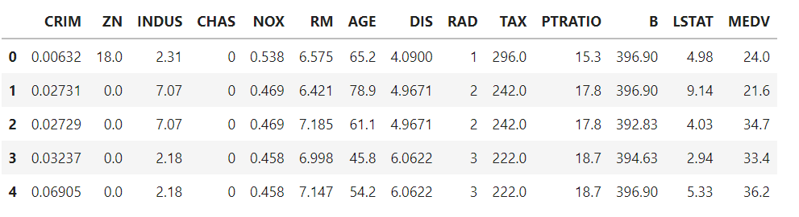

## 3.方法介绍

### 3.1数据预处理(如有)

1. 第一个Part的MNIST数据集

没有任何预处理, 会提前观察一下图片的情况

2. House Price数据集

没有对数据项的直接处理，因为数据集没有缺少的数据项，数据值的分布范围看起来都比较正常，合理；虽然单位不一致，但是经过后续的转化后，都可以化成标准分布的数据，从而不会产生很大的影响。

### 3.2算法描述

两个实验所用到的核心都是SVM算法, 这里一并介绍:

**SVM-支持向量机**

- 输入: 样本集合 $T = \{(x_1, y_1), ..., (x_n, y_n)\}$, $x$为输入变量, $y$为输出值(eg. 属于的类别)

- 输出: 我们的SVM模型 $y = w^Tx + b$

$w^T = w^{\star}$, $b = b^{\star}$ 

满足条件 $maxmin(f(x_i)) = max(min|{w^{*}}^{T}x + b|)$

其中 我们记录$\rho = |w^{T}x + b|$ 为样本点的绝对距离, 由于此时我们的系数$w^*$的模大小是1, 因此实际的距离$y_i *f(w^Tx+b)/|w|$也就是上式的值(由于我们是一个二分类问题, $y_i$取值为$\{1, -1\}$)

- 映射函数: $y = f(x_i) = w^Tx + b$

- 目标: 最大化 **样本点到 决策平面的最小距离**, 此时落在这个最小距离上的样本被称为支持向量

- 目标函数 $min_w\{ \frac{1}{2} |w|^2\},\ s.t.\ \forall_{i = 1}^n y_i(w^Tx_i + b) \geq 1$

要证明我们的分类器SVM能够收敛, 我们这里沿用感知机模型的结论(感知机不要求这个函数距离的最小, 只要求分类正确因此可以存在很多个)

- 收敛性, 最多经过$(b^2 + 1)(R^2 + 1) / \rho^2$ 次更新,就能找到答案($R = max_i ||x_i||$)

- SVM的重要参数: $\rho$ 几何距离大小(当$|w| = 1$时也就是函数距离)

$\rho$(margin) 决定了:
1. 两个类是如何区分的
2. 算法收敛的速度

SVM定义了函数距离

$\rho_f(x, y) = y \times f(x)$

$min\rho_f = \rho_{min} = min(\rho_f(x_i, y_i))$

目标就是找到一个模型满足:

$f* := argmax_f\rho_{min} = argmax_f min\rho_f(x_i,y_i)$

实际上也就是
$y = w^Tx + b$, 寻找一组参数$w^* = (w,b)$, 使得$\rho = min(y_i (\frac{w\cdot x}{|w|} + \frac{b}{w}))$ 最大(间隔最大)

当我们的$\rho > 0$时, SVM是硬间隔支持向量机。

以上是基本的SVM模型, 而如何更好地求解SVM引入了对偶形式地SVM

**原问题**

$argmax_{w,b}\ \rho,\ s.t.\ \frac{y_i(w^Tx+b)}{|w|} \geq \rho$

等价于
- 标准形式下(最近距离$\rho = 1$)的目标函数 $min_w\{ \frac{1}{2} |w|^2\},\ s.t.\ \forall_{i = 1}^n y_i(w^Tx_i + b) \geq 1$

引入Lagrange乘数项

- 转为求解 $L(w,b,\alpha) = \frac{1}{2}|w|^2 - \sum_{i = 1}^n\alpha_i (y_i(w^Tx_i + b) - 1))$

求导数为0得到中间结果

$w = \sum_{i = 1}^n \alpha_i y_i x_i$

$\sum_{i  =1}^n\alpha_i y_i = 0$

代入原式 $L(w,b,\alpha) = \frac{1}{2}|w|^2 - \sum_{i = 1}^n\alpha_i (y_i(w^Tx_i + b) - 1))$

得到化简结果(w化简自然引入**内积**, 这也是后面非线性/核方法的重要基础)

$L(\alpha) = \sum_{i = 1}^n\alpha_ -  \frac{1}{2}\sum_{i=1}^n\sum_{j=1}^n y_iy_j \alpha_i \alpha_j (x_i \cdot x_j)$

使得$\alpha_i \geq 0,\ 1\leq i \leq n$成立;

以及 $\sum_{i = 1}^n \alpha_i y_i = 0$

求出$\alpha$ 得到了 $w^*$

观察$f(x) = w^Tx + b = \sum_{i = 1}^n \alpha_i y_i x_i^T x + b$

对于所有支持向量$x_j$满足$y_jf(x_j) = 1$

也就是说$f(x_j) = \sum\alpha_i y_i (x_i \cdot x_j) + b$

$b^* = \frac{1}{N_s}\sum_{j\in S}(y_j - \sum_{i\in S} \alpha_i y_i x_i \cdot x_j)$
(其实就是所有支持向量的均值)

于是我们的判别函数
$f(x) = sgn(\sum_{i = 1}^n\alpha_i^* y_i x_i^T x + b^* )$就求出来了;

---

2. Non-Linear SVM 非线性支持向量机

- $L(\alpha) = \sum_{i = 1}^n\alpha_i -  \frac{1}{2}\sum_{i=1}^n\sum_{j=1}^n y_iy_j \alpha_i \alpha_j (x_i \cdot x_j)$

- 这里将原先的线性SVM内积换成核函数$K(x_i, x_j)$

得到代入核函数的内积

- $L(\alpha) = \sum_{i = 1}^n\alpha_i -  \frac{1}{2}\sum_{i=1}^n\sum_{j=1}^n y_iy_j \alpha_i \alpha_j (K(x_i, x_j))$

使得$\alpha_i \geq 0,\ 1\leq i \leq n$成立;

以及 $\sum_{i = 1}^n \alpha_i y_i = 0$

最终我们的分类函数可以表示为:

$f(x) = \sum_{i = 1}^n\alpha_i^* y_i K(x_i, x) + b^*$

为了能够更快求解Kernel-product, 我们对于给定的函数$k: X^2 \to K$, 以及原空间的向量模式$(x_1,...,x_n)\in X$

Gram矩阵$K_{ij} = k(x_i,x_j)$(内积矩阵)

于是就可以更快求解上面的目标式。

常用的核函数

- 高斯核函数 $k(x,x') = e^{-\frac{|x-x'|^2}{2\sigma^2}}$

- 多项式核函数 $k(x,x') = (x^T x + c)^d$

## 4.实验结果分析

### 4.1评价指标

1. MNIST的数据集

评价指标自然是分类的准确率 $p$ (分类正确个数/总测试样本数)

2. Boston房价数据集

由于是一个回归问题, 合理的评价标准是偏离度/SSE

- 这里采用 MSE(Mean Squared-Error) 以及确信度(也叫R^2系数)

### 4.2定量评价结果

#### 1. MNIST分类结果

使用SVM/非线性SVM对于手写数字进行分类。

辅助函数

- `show_pics` 用于展示几张经过模型学习过的图片样式 和 实际的结果
- `submit_result` 用于提交我们的SVM模型预测结果到kaggle-submission

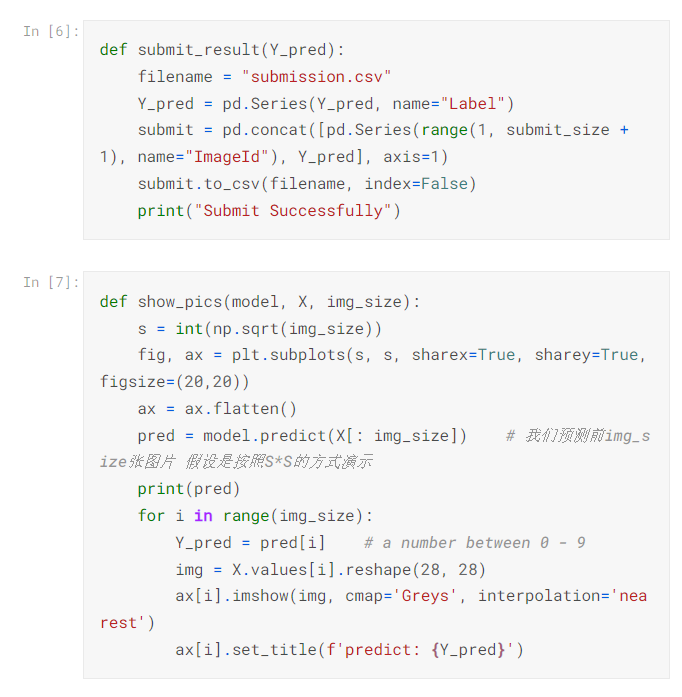

##### 基本的线性SVM

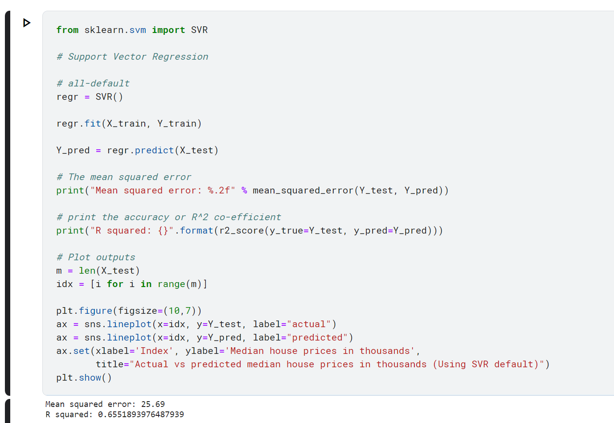

经过基本的SVM模型学习后，我们来预测几张图片观察以下模型的效果

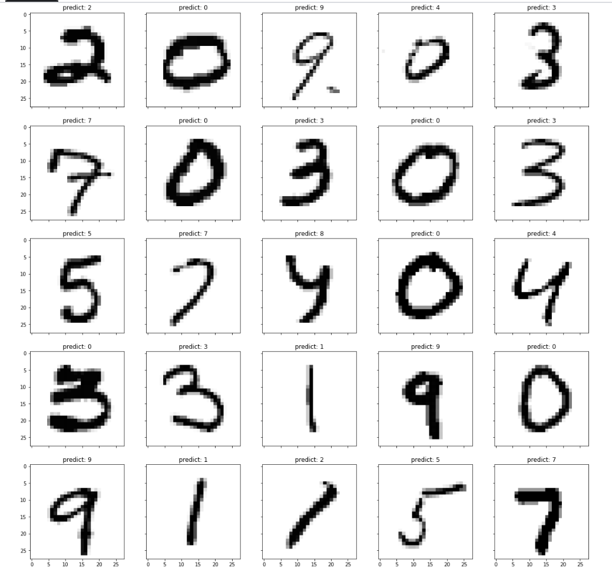

可以看到正确率已经有了80%以上，但是还是有很明显的错误识别(比如右上角的'3')被识别成了'2';

##### 非线性的SVM

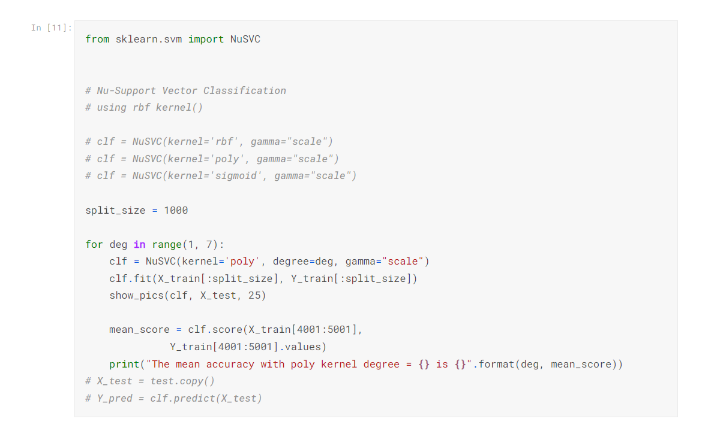

#### 2. Boston预测准确率

##### 线性SVM的实验结果

具体的分类器代码实现
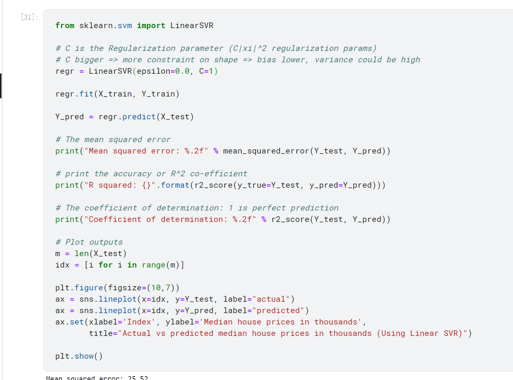

- 最终的预测结果与实际数据之间的MSE大小为$25.38$
- 确信度(R-squared) 系数为 $0.659$

##### 多项式核函数SVM

具体的分类器代码实现

- 经过试验后，挑选的多项式核函数度数为$3$, 正则项系数$C=10$

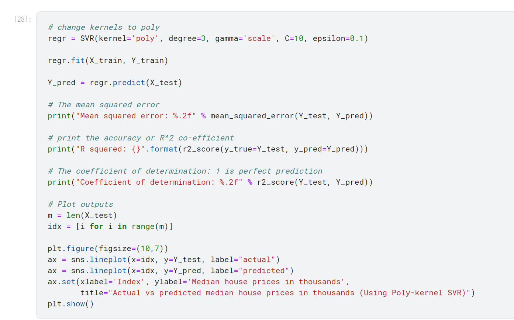

- 最终的预测结果与实际数据之间的MSE大小为$16.47$
- 确信度(R-squared) 系数为 $0.78$

##### 径向基函数SVM

具体的分类器代码实现如下所示

- SVR的默认实现就是 `rbf`

RBF（Radial Basis Function，径向基函数）是一个函数空间中的基函数，而这些基函数都是径向函数。

径向函数: 满足对于围绕着某固定点 $c$ 的等距的 $x$，​函数值相同
$$
\phi(x) = \phi(||x-C||)
$$

使用rbf回归的svr代码：

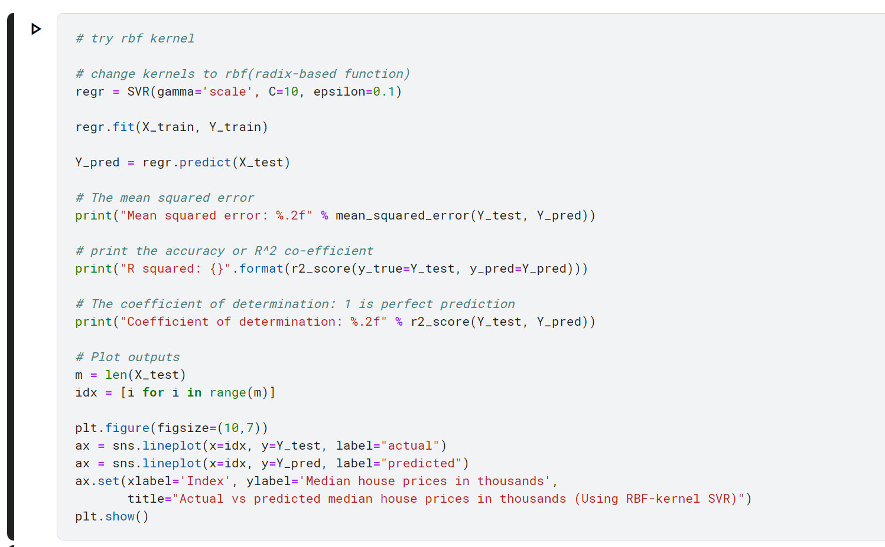

- 最终的预测结果与实际数据之间的MSE大小为$13.82$ 可以看到较线性的SVR提升很大
- 确信度(R-squared) 系数为 $0.82$

### 4.3可视化结果

1. MNIST分类结果

- 使用最简单的线性SVM提交测试结果

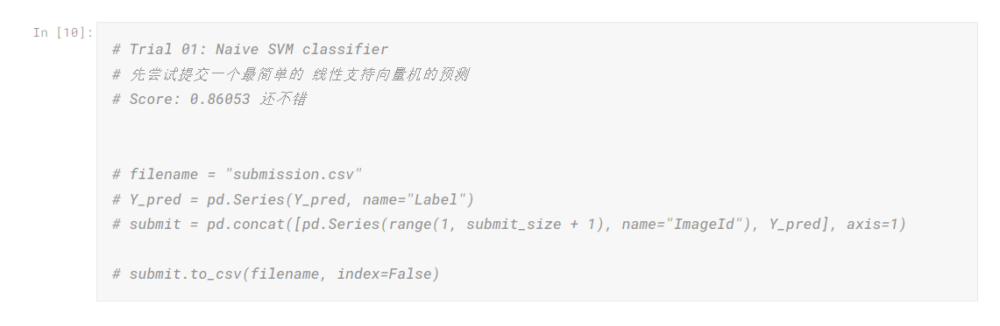

即使是最简单的SVM，也已经可以达到86%左右的正确率了

- 使用多项式核函数的SVM

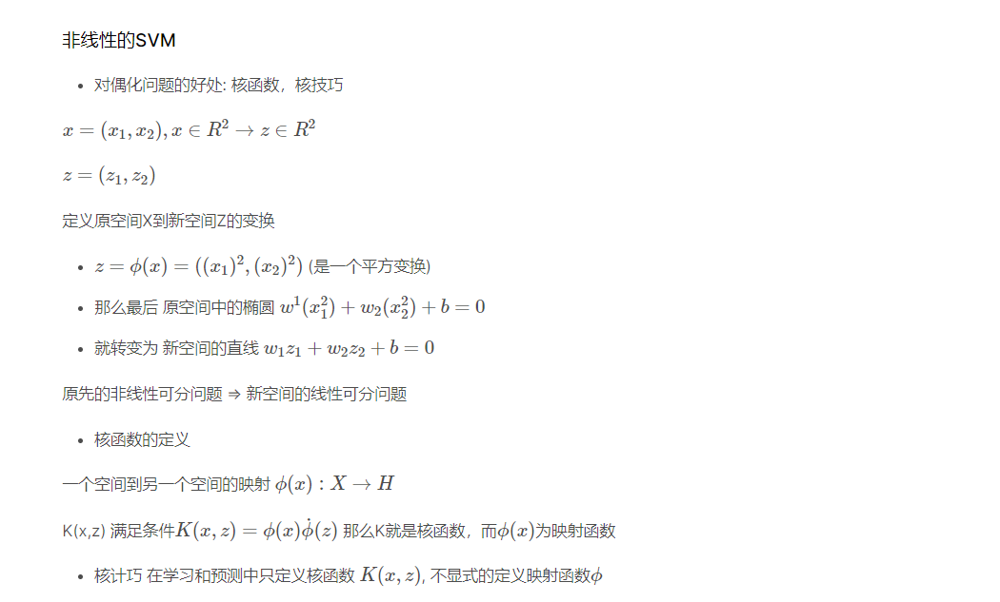

代码实现:
- `kernel`挑选为多项式核
- 测试的多项式次数为`3`
- 正则项系数$C$的大小为10

后来经过了一系列的挑选和尝试，最终设置了SVC的多项式核函数度数为2

- 度数的选择

发现选择度数 = 2好像更好;

代码:

结果:
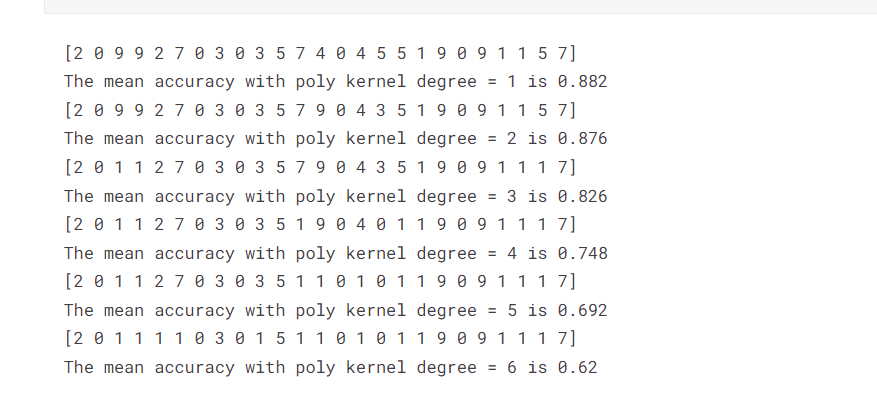

**最终选择多项式核函数的SVM**

预测结果:

- 预测的准确率达到了$0.95$附近的水平，已经很高了；
这也说明原先的数字分类问题不是一个线性可分的分类问题。
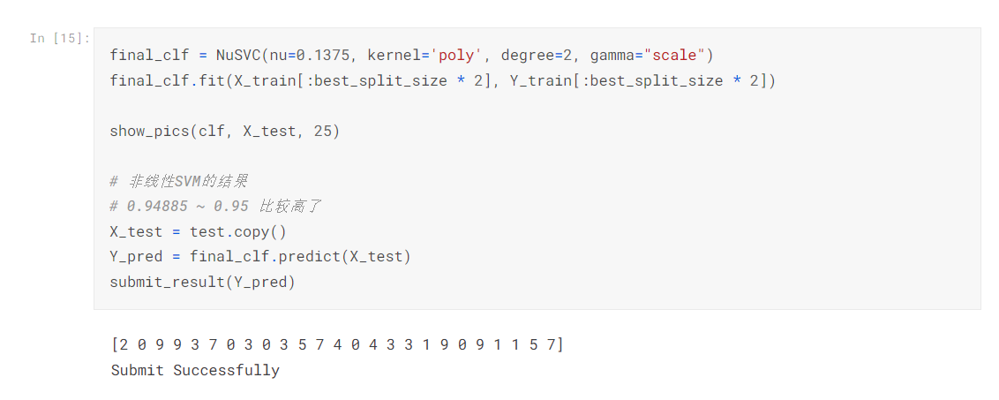

2. Boston预测准确率

最终的实验结果和分布曲线拟合情况如下所示：

- 线性SVR的实验结果
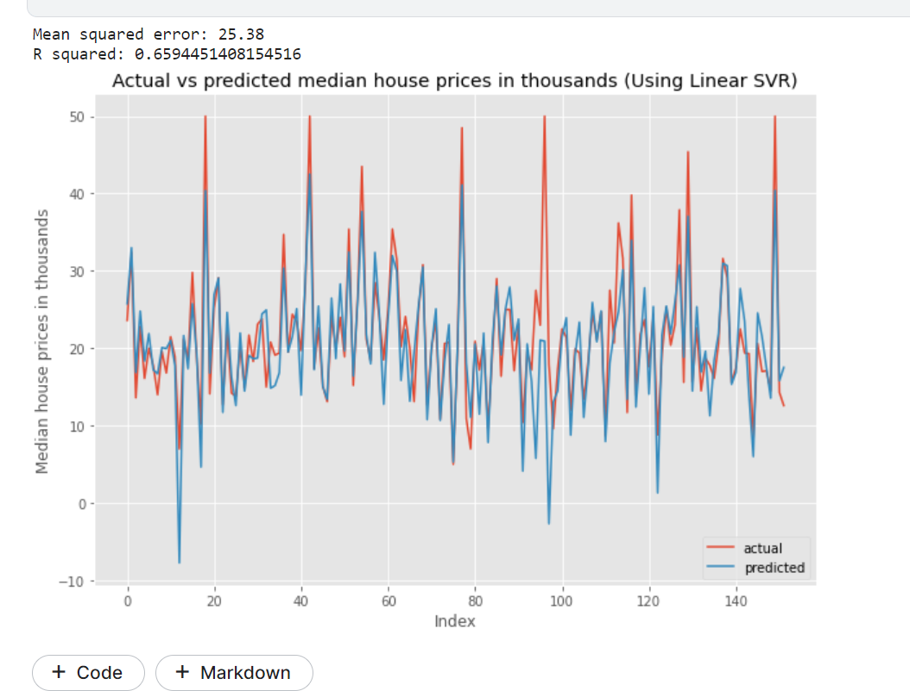

- 使用rbf核函数的SVR
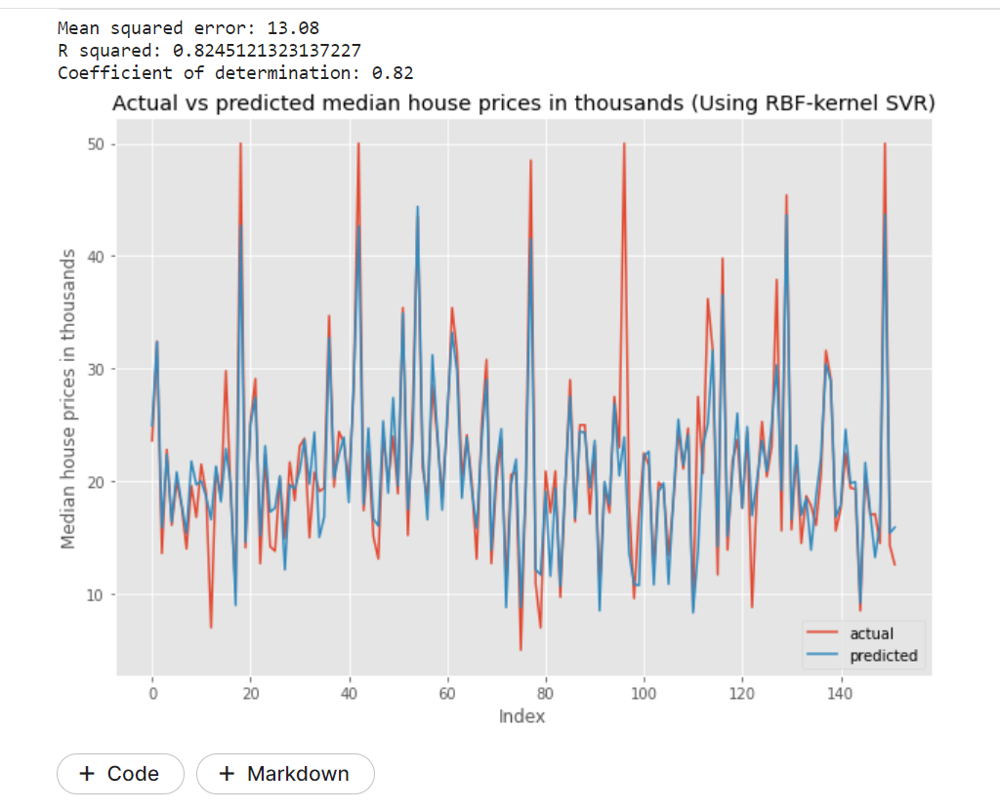

- 多项式核函数的SVR

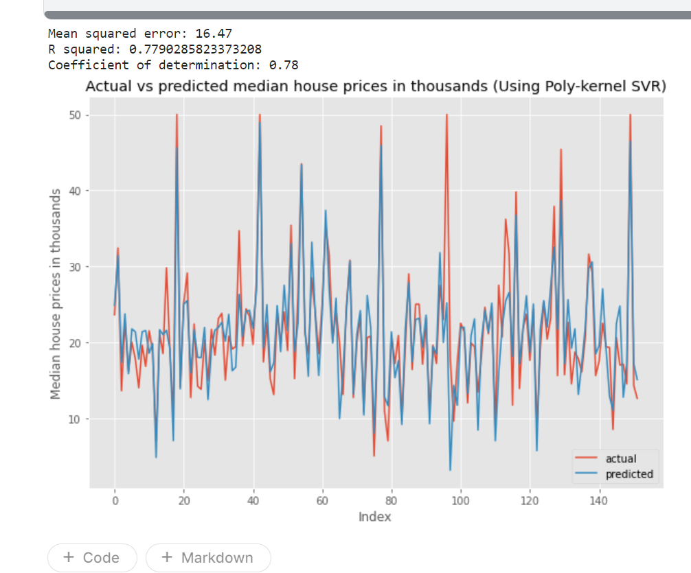

## 5.总结 

    比较不同方法的优缺点等。

SVM总结:

SVM算法是用于分类问题非常实用的一种算法；
- SVM的优势在于解决小样本、非线性和高维的回归和二分类问题；
- 由于支持向量的数量其实占整个数据集合的比例通常不会很大，因此SVM可以用于选取数据集中的代表元，还可以用于缩小问题规模；
- 核函数方法扩展的SVM还可以解决非线性的分布下的分类问题，使得SVM更为实用。

使用核函数的SVM(SVR)
- 常用的核函数有多项式核函数(poly-kernel), rbf 径向基函数, Gaussian核函数等等；
- 核函数的技巧使得原先只能处理线性问题的SVM可以在更高的维度中处理原输入空间的非线性问题。