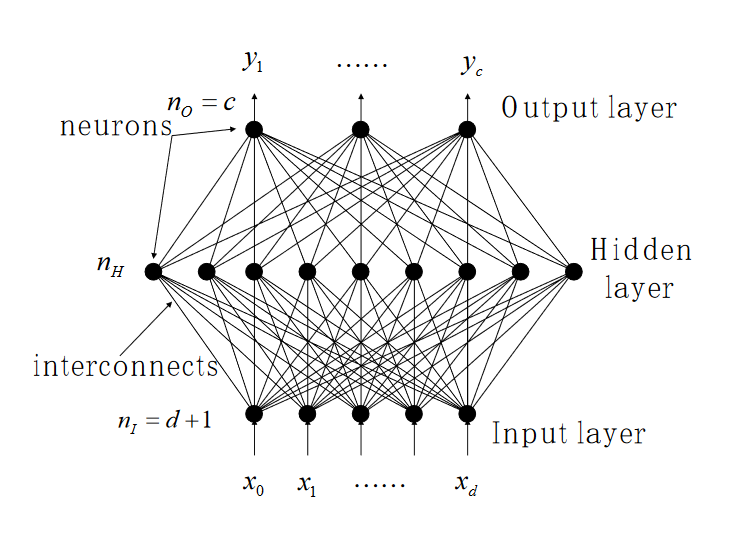
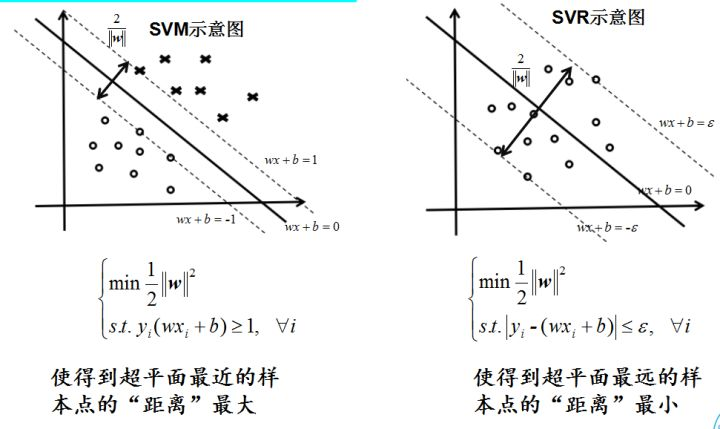

placeholder replace me!
<!--more-->

1. 机器学习三要素
    - 映射函数
    - 目标函数
    - 设计算法

2. 按照基本的分类
    - 分类算法
    - 回归算法

3. 重点
    - 算法的设计, 物理含义, 适用场景;
    - 映射函数/损失函数的设计, 公式含义;

# 期中复习

## 分类算法

线性模型分类器

1. 分类 与 回归 的区别

回归: 对于每一个输入$x$ 输出一个预测$y$为实数值;

分类: $X->Y = C_k$ 也就是映射出的值是一个标签(K = 2, K > 2)的情况

- 1-of-K 编码 (1, 0, 0, 0, 0) - (0, 0, 0, 0, 1)

输入空间被划分成 决策区域，边界就是决策平面/决策边界

判别函数 $F(X) = C_K$ discriminant function

或者 概率函数$P(C_K|X)$ 指的是一个输入属于某一类别的概率大小

- 基于概率的决策分类模型: 对于$P(C_K | X)$进行概率预测, 建模

- 或者 生成模型

- $P(X|C_K)$ 我们的预测值,给定标签$C_K$ 问出现输入为$X$的概率是多少?
- $P(C_K) $ 先验已知
- 利用贝叶斯 推算后验概率 $P(C_K | X) = \frac{P(X|C_K)P(C_K)}{P(X)}$

机器学习的两类模型: 判别模型和生成模型

基础线性模型 $y(x) = w^Tx+b$
$y(x) = f(w^Tx + b)$

泛化的线性模型- 分布在$(0, 1)$之间

$f(.)$是激活函数

- 决策平面仍然是x的线性函数,即使激活函数非线性

## 分类算法整理(Classification)

输入变量$x$, 模型$y = f(w,x)$, 输出$y_k \in \{C_1, ..., C_k\}$ 离散值

### 1. 感知机 Perceptrons

**模型**

单层神经元模型

模型可以表示为一个广义上的线性模型(关于基函数basis-function)

- $x$为我们的输入变量, $\phi(x)$为基函数, $w$为待学习的参数

$$
y(x) = f(w^T\phi(x))
$$

这里的**非线性**激活函数 $f(*) = sgn(x)$ 也就是符号阶跃函数
即 $f(a) = 1, a \geq 0;\ f(a) = -1, a \lt 0$

**评价标准**

- (判别模型)错分的实例数量
- (生成模型)概率分布

例如输出变量$t \in \{-1, +1\}$ 表示二分类的$C_1, C_2$

那么有$1 = t = w^T\phi(x), t\in C_1, t > 0$

否则$-1 = t < 0$

误差函数

- 定义$\phi_i = \phi(x_i)$ 即对应第$i$个实例向量
- $E(w) = -\sum_{\phi_i \in M} w^T \phi_i t_i$ ，实际上就是错分类的数量

对这个函数进行梯度下降可以求解最优解；

学习过程：SGD

$w' = w - \eta \frac{\partial E}{\partial w} = w + \eta \phi_i t_i$

- 如果存在错误实例/$E(w)$大于0，就不断更新$w$

- 收敛性证明: 数据实例线性可分情况下始终会收敛

简单的证明:

当前的损失
$$E(w) = -w\phi(x_i)y_i$$

更新后
$$
E(w') = -w'\phi(x_i)y_i = -(w+\eta \phi_i t_i)\phi(x_i)y_i = E(w) - \eta (\phi_i y_i)^T \phi_i t_i
$$

而后面这一项由定义可知总是非负数;因此如果存在最优解总是会在有限时间内收敛.

#### 总结

- 优点: 简单，对线性可分问题总是可求解，可扩展；
- 缺点：受数据影响大，无法支持非线性可分问题，学习率选取？

### 2. KNN

#### 模型

输入: 训练数据集
$$
T = \{(x_1,y_1), ..., (x_n, y_n)\}
$$

输出: 实例 $x$ 所属的类$y$

- 根据给定的距离计算方式，在T中寻找$x$最近的k个点，这个区域记作$N_k(x)$
- 在区域$N_k(x)$内进行选择，取最多的出现标签

所以得出最终的推测结果$y$

$$
y = argmax_{c_j} \sum _{x_i \in N_k(x)} I(y_i = c_j)
$$

#### 误差函数

- 距离度量的选择

L1距离 $L_1(x_i,x_j)$

L2距离 $L_2(x_i,x_j)$

Lp距离 == Minkowski距离 $L_p(x_i,x_j) = (\sum_{l=1}^n |x_i^l - x_j^l|^p)^{\frac{1}{p}}$

- k值大小的选择

较小的$k$: 敏感 容易被噪声点影响, 学习的近似误差会减小；但是估计误差会增大

较大的$k$: 有效减小学习的估计误差，但是近似误差会变大

- 多数表决原则

错误分类的概率 $P(Y \neq F(x)) = 1 - P(Y = F(x))$

给定领域$N_k(x)$ 那么错误分类的概率等于 $1 - \frac{1}{k}\sum_{x_i \in  N_k(x)} I(y_i = c_j)$

为了尽可能缩小错分概率 == 尽可能增大分类正确的概率

#### KNN的实现-kd tree

给定一个目标点，首先搜索最近邻，找到包含目标点的kd-node，然后依次回退到它的parent节点，不断寻找与目标点距离最近的节点直到找不到更近的节点。

- kd-node 每一个节点对应了k-dimension种某一个维度的二分区域结果，叶子节点中只包含一个实例点

- 在kd树上搜索(K)最近邻可以高效利用节点的性质完成

### 3. 朴素贝叶斯

模型在给出已知的样本训练集分布$p(x)$以及此时的先验输出概率$p(y)$, 试图学习条件概率$p(y|x)$的分布模型, 使得其表现的**最好**, 这就是贝叶斯学习的基本想法.

### 4. Logistic回归(最大熵模型)

逻辑斯蒂回归-分类常用的算法

引入：bayes公式=> logistc函数
$$
P(C_1 | x) = \frac{p(x|C_1) P(C_1)}{p(x|C_1)P(C_1) + p(x|C_2)P(C_2)} = \frac{1}{1 + e^-a} = \sigma(a)
$$

那么求解$a = ln \frac{p(x|C_1)P(C_1)}{p(x|C_2)P(C_2)}$  (后面可以看到实际上就是**几率**)

#### 模型

- logistic函数 $\sigma(x) = \frac{1}{1+e^{-x}}$

- 对于二分类问题 定义几率
$$
logit = \frac{p(c_1)}{p(c_2)} = \frac{p(c_1)}{1 - p(c_1)}
$$

- logistic函数的反函数就是 ln几率

$x = ln(\frac{\sigma(x)}{1 - \sigma(x)})$

- logistic函数作为激活函数: 使得我们的判别结果可以理解为**后验概率**

多分类问题下的logistic函数

- 标准化 exp/softmax函数

$$
P(C_k|x) = \frac{p(x|C_k) P(C_k)}{\sum_j p(x|C_j)P(C_j)} = \frac{exp(a_k)}{\sum_j exp(a_j)}, \ where\ a_k = ln\ p(x|C_k)P(C_k)
$$

以上讨论的都是离散取值的情况，对于连续的情况，我们假设样本关于标签取值是正态分布

#### 评价标准

定义误差函数(交叉熵)

对于一个数据集$\{x_n, t_n\}$, $t_n \in \{0,1\}$

- 输出为标签$t$的概率似然函数可以写作是:

$P(t|w) = \Pi_{n=1}^N y_n^{t_n} (1 - y_n)^{1 - t_n}$ 也就是每一个分量取到正确值的概率之积

损失函数就是它的负对数:

- $E(w) = -ln P(t|w) = -\sum_{n=1}^N(t_n ln y_n + (1 - t_n) ln (1 - y_n))$

也被称为交叉熵误差，其中$y_n = \sigma(a_n) = \sigma(w^Tx + b) = \sigma(w^T\phi)$

#### 总结

- logistic函数与对数几率;

- 误差函数定义为交叉熵损失($-ln P(t|w)$), 对后验概率的对数取负数;

- 多分类情况 => softmax函数

- $P(t|w) = \sigma(a) = \sigma(w^Tx+b)$ 可以看出对数几率 关于输入$x$是一个线性函数，这也就是模型的本质

### 5. 决策树*

### 6. SVM(线性, 核方法)

**SVM-支持向量机**

- 输入: 样本集合 $T = \{(x_1, y_1), ..., (x_n, y_n)\}$, $x$为输入变量, $y$为输出值(eg. 属于的类别)

- 输出: 我们的SVM模型 $y = w^Tx + b$

$w^T = w^{\star}$, $b = b^{\star}$

满足条件 $maxmin(f(x_i)) = max(min|{w^{*}}^{T}x + b|)$

其中 我们记录$\rho = |w^{T}x + b|$ 为样本点的绝对距离, 由于此时我们的系数$w^*$的模大小是1, 因此实际的距离$y_i*f(w^Tx+b)/|w|$也就是上式的值(由于我们是一个二分类问题, $y_i$取值为$\{1, -1\}$)

- 映射函数: $y = f(x_i) = w^Tx + b$

- 目标: 最大化 **样本点到 决策平面的最小距离**, 此时落在这个最小距离上的样本被称为支持向量

- 目标函数 $min_w\{ \frac{1}{2} |w|^2\},\ s.t.\ \forall_{i = 1}^n y_i(w^Tx_i + b) \geq 1$

要证明我们的分类器SVM能够收敛, 我们这里沿用感知机模型的结论(感知机不要求这个函数距离的最小, 只要求分类正确因此可以存在很多个)

- 收敛性, 最多经过$(b^2 + 1)(R^2 + 1) / \rho^2$ 次更新,就能找到答案($R = max_i ||x_i||$)

- SVM的重要参数: $\rho$ 几何距离大小(当$|w| = 1$时也就是函数距离)

$\rho$(margin) 决定了:

1. 两个类是如何区分的
2. 算法收敛的速度

SVM定义了函数距离

$\rho_f(x, y) = y \times f(x)$

$min\rho_f = \rho_{min} = min(\rho_f(x_i, y_i))$

目标就是找到一个模型满足:

$f* := argmax_f\rho_{min} = argmax_f min\rho_f(x_i,y_i)$

实际上也就是
$y = w^Tx + b$, 寻找一组参数$w^* = (w,b)$, 使得$\rho = min(y_i (\frac{w\cdot x}{|w|} + \frac{b}{w}))$ 最大(间隔最大)

当我们的$\rho > 0$时, SVM是硬间隔支持向量机。

以上是基本的SVM模型, 而如何更好地求解SVM引入了对偶形式地SVM

**原问题**

$argmax_{w,b}\ \rho,\ s.t.\ \frac{y_i(w^Tx+b)}{|w|} \geq \rho$

等价于

- 标准形式下(最近距离$\rho = 1$)的目标函数 $min_w\{ \frac{1}{2} |w|^2\},\ s.t.\ \forall_{i = 1}^n y_i(w^Tx_i + b) \geq 1$

引入Lagrange乘数项

- 转为求解 $L(w,b,\alpha) = \frac{1}{2}|w|^2 - \sum_{i = 1}^n\alpha_i (y_i(w^Tx_i + b) - 1))$

求导数为0得到中间结果

$w = \sum_{i = 1}^n \alpha_i y_i x_i$

$\sum_{i  =1}^n\alpha_i y_i = 0$

代入原式 $L(w,b,\alpha) = \frac{1}{2}|w|^2 - \sum_{i = 1}^n\alpha_i (y_i(w^Tx_i + b) - 1))$

得到化简结果(w化简自然引入**内积**, 这也是后面非线性/核方法的重要基础)

$L(\alpha) = \sum_{i = 1}^n\alpha_ -  \frac{1}{2}\sum_{i=1}^n\sum_{j=1}^n y_iy_j \alpha_i \alpha_j (x_i \cdot x_j)$

使得$\alpha_i \geq 0,\ 1\leq i \leq n$成立;

以及 $\sum_{i = 1}^n \alpha_i y_i = 0$

求出$\alpha$ 得到了 $w^*$

观察$f(x) = w^Tx + b = \sum_{i = 1}^n \alpha_i y_i x_i^T x + b$

对于所有支持向量$x_j$满足$y_jf(x_j) = 1$

也就是说$f(x_j) = \sum\alpha_i y_i (x_i \cdot x_j) + b$

$b^* = \frac{1}{N_s}\sum_{j\in S}(y_j - \sum_{i\in S} \alpha_i y_i x_i \cdot x_j)$
(其实就是所有支持向量的均值)

于是我们的判别函数
$f(x) = sgn(\sum_{i = 1}^n\alpha_i^* y_i x_i^T x + b^* )$就求出来了;

---

2. Non-Linear SVM 非线性支持向量机

- $L(\alpha) = \sum_{i = 1}^n\alpha_i -  \frac{1}{2}\sum_{i=1}^n\sum_{j=1}^n y_iy_j \alpha_i \alpha_j (x_i \cdot x_j)$

- 这里将原先的线性SVM内积换成核函数$K(x_i, x_j)$

得到代入核函数的内积

- $L(\alpha) = \sum_{i = 1}^n\alpha_i -  \frac{1}{2}\sum_{i=1}^n\sum_{j=1}^n y_iy_j \alpha_i \alpha_j (K(x_i, x_j))$

使得$\alpha_i \geq 0,\ 1\leq i \leq n$成立;

以及 $\sum_{i = 1}^n \alpha_i y_i = 0$

最终我们的分类函数可以表示为:

$f(x) = \sum_{i = 1}^n\alpha_i^* y_i K(x_i, x) + b^*$

为了能够更快求解Kernel-product, 我们对于给定的函数$k: X^2 \to K$, 以及原空间的向量模式$(x_1,...,x_n)\in X$

Gram矩阵$K_{ij} = k(x_i,x_j)$(内积矩阵)

于是就可以更快求解上面的目标式。

常用的核函数

- 高斯核函数 $k(x,x') = e^{-\frac{|x-x'|^2}{2\sigma^2}}$

- 多项式核函数 $k(x,x') = (x \cdot x' + c)^d$

7. MLP 多层感知机/Feed Forward networks

MLP的结构:

- 输入层
- 隐层
- 输出层

特点:

- 输入层大小为输入向量的维数
- 隐层之间的神经元是全连接的
- 隐层神经元的激活函数是非线性的

- 对于网络中的第j个神经元而言, 它所收到的响应为 $net_j = \sum_{i = 1}^d w_{ji} x_i + w_{j0} = \sum_{i = 0}^d w_{ji} x_i = w_j^T \cdot x$

- 因此, 第j个神经元的输出就是$y_j = g(net_j)$

- 对于输出层的第$k$个神经元, 它的信号相应就是$net_k = \sum_{j = 1}^{n_H} w_{kj} y_j + w_{k0} = \sum_{j=0}^{n_H}w_{kj} y_j = w^T_k \cdot y$
- 最终对于标签分类为$k$的输出就是$y_k = f(net_k) = f(w^T_k \cdot y) = f(\sum_{j = 0}^{n_H} w_{kj} f(net_j)) = f(\sum_{j = 0}^{nH} w_{kj} f(\sum_{i = 0}^d w_{ji} x_i))$

- 对于二分类问题而言, $y_k \in \{1, -1\}$

- 对于多分类问题, $y_k = f(net_k) = g_k(x)$

---

MLP采用的不同Loss function

- SSE Sum of Squared Loss

> 物理意义上, 就是实际输出与我们预测的输出之间的方差

$$
E(w) = \frac{1}{2} \sum_{n = 1}^N (y(w, x_n) - t_n)^2
$$

- 概率上的解释: 网络输出给出了一种概率上的分布, 使用概率的好处 1. 可以引入非线性 2. 更多的loss选择

从概率论的角度分析

NN学习到的是一个关于输出变量$t$的概率分布

$P(t|w, x) = N(t| y(w,x), \beta^{-1})$

- 假设初始的输入数据$x$关于输出标签$t$的取值是一个高斯分布, 期望$\mu = y(w,x)$ 方差为$\beta^{-1}$

假设我们的输入是独立同分布的, 那么对于所有的标签$t=(t_n)_{n=1}^N$
我们列出似然函数

$P(t|w,x,\beta) = \Pi_{n=1}^n P(t_n|w,x_n, \beta)$

$P(t_n | w, x_n, \beta) = \frac{\beta}{\sqrt 2\pi} exp(\frac{-\beta}{2}(t_n - y(w,x_n)^2))$

对数似然函数就是
$L = \sum_{n=1}^N ln(P(t_n | w,x_n,\beta)) =\frac{N}{2}(ln\beta - ln 2\pi) - \frac{\beta}{2}(y(w,x_n) - t_n)^2 $

让对数似然函数最大 **等价于** 让 $\frac{\beta}{2}(y(w,x_n) - t_n)^2$ 最小化,正好就是平方误差SSE最小化!
> 因此从概率角度我们发现概率最大 == 误差最小, 可以转变为一个学习概率分布的问题

---

使用的误差函数有:

Cross-Entrophy Loss 交叉熵

对于一个二分类问题而言

$t$是输出变量;

- $t = 1$对于$C1$;
- $t = 0$对于$C2$;

网络有单个输出, 输出激活函数是

$$
y = \sigma(a) = \frac{1}{1 + e^{-a}}
$$

那么输出为$t$的概率是:
$$
P(t|X, w) = y(x, W)^t (1 - y(x, W))^{1 - t}
$$

相应的误差函数

$$
E(w) = -\sum_{n = 1}^N\{t_n ln y_n + (1 - t_n) ln(1 - y_n) \}
$$

K分类 输出激活函数为 logistic函数

- 输出标签值为$t$的概率就是
$$
P(t|w,x) = \Pi_{k=1}^K y_k(w,x)^{t_k} (1 - y_k(w, x))^{1 - t_k}
$$

对应的损失函数
$$
E(w) = -\sum_{n=1}^N\sum_{k=1}^K\{t_{nk} ln y_{nk} + (1 - t_{nk}) ln (1 - y_{nk})\}
$$

1-of-K coding

- 不断地用二分类的方式区分标签值为k的概率与非k的概率
- 输出$y_k$的概率公式: $y_k(w,x) = \frac{exp(a_k(w,x))}{\sum_j exp(a_j(w,x))}$

---

多层感知机的BP算法

- Error BackPropagation

- 从隐藏层到输出层的学习

由于输出层 第$k$个单元的响应为

$net_k = \sum_{j=0}^{n_H} w_{kj} y_j$

所以对于给定的$E(w)$, 关于隐层到输出层系数的梯度

$$
\frac{\partial E}{\partial w_{kj}} = \frac{\partial E}{\partial net_k}
\frac{\partial net_k}{\partial w_{kj}}
= -\delta_{k} \frac{\partial net_k}{\partial w_{kj}}
$$

- $\delta_k$是第$k$个单元的sensitivity(敏感度)

假设激活函数f是可微分的

$$
\delta_k = \frac{\partial E}{\partial net_k}
= \frac{\partial E}{\partial y_k}
\frac{\partial y_k}{\partial net_k}
=(t_k - y_k) f'(net_k)
$$

(因为这里的误差函数就是SSE)

又因为 $net_k = w_{kj}^T \cdot y_j$
所以$\frac{\partial net_k}{\partial w_{kj}} = y_j$

最终得到隐层-输出层的梯度学习规则

$$
\Delta_{kj} = \eta \delta_k y_j
= \eta (t_k - y_k) f'(net_k) y_j
$$

其中$\eta$是我们定义的学习率

- 从输入层到隐藏层的学习

第$j$个神经元的响应$net_j = \sum_{i=0}^d w_{ji}x_i$

而根据我们的结构, 可以列出以下的梯度关系
$$
\frac{\partial E}{\partial w_{ji}}
= \frac{\partial E}{\partial y_j}
\frac{\partial y_j}{\partial net_j}
\frac{\partial net_j}{\partial w_{ji}}
$$

由于 $\frac{\partial net_j}{\partial w_{ji}} = x_i$
以及 $\frac{\partial y_j}{\partial net_j} = f'(net_j)$

还有误差函数关于输出y的导数
$$
\frac{\partial E}{\partial y_j}
= \frac{\partial}{\partial y_j}[\frac{1}{2}\sum_{k=1}^c (t_k - y_k)^2]
= -\sum_{k=1}^c(t_k-y_k) \frac{\partial y_k}{y_j}
= -\sum_{k=1}^c(t_k-y_k) \frac{\partial y_k}{net_k} \frac{\partial net_k}{y_j}
=  -\sum_{k=1}^c(t_k-y_k) f'(net_k) w_{kj}
$$

类似的我们定义一个隐层单元的敏感度
$\delta_j = f'(net_j) \sum_{k=1}^c w_{kj} \delta_k$

那么对于输入层-隐层的学习规则我们得到

$$
\Delta w_{ji} = \eta \delta_j x_i = \eta f'(net_j) [\sum_{k=1}^c w_{kj}\delta_k] x_i
$$

---

MLP在实际应用中需要考虑的问题

1. 激活函数的选择: 非线性/线性, 单调性, 连续性

2. 隐层的神经元数量 $n_H \to n/10$

3. 初始网络的权重

4. 学习率大小$\eta = 0.1$

5. 权重的衰减

6. 隐层的数量

7. 目标函数的选择

## 回归算法整理

### 1. Linear Regression

输入: 训练数据集$T = \{(x_1,y_1), ..., (x_n, y_n)\}$

输出: regression-function 回归函数 $y = f(w,x) = w^Tx + b$

目标: 最小化误差函数 例如MSE, $min_w E(w) = \frac{1}{n} |y(w,x) - y|^2$

找到的最优参数 $w^* = argmin_{w}\sum_{i=1}^n(y(w,x) - y)^2$

寻找最优参数的方法:

1. SGD 随机梯度下降;

2. 解析法: 最小二乘解$(X^TX)^{-1}X^Ty$

### 2. Lasso, Ridge

Ridge

目标: 最小化误差函数 $L = \sum_{i=1}^n (y_i - w^Tx_i)^2 + \lambda ||w||^2$

- $w^* = argmin_w (\sum_{i=1}^n (y_i - w^Tx_i)^2 + \lambda ||w||^2)$

解析算出的最优解$\boldsymbol{w} = (X^TX + \lambda I)^{-1} X^T y$ 或者用SGD

Lasso

目标: 最小化误差函数 $L = \sum_{i=1}^n (y_i - w^Tx_i)^2 + \lambda ||w||_1$

- 最优参数 $w^* = argmin_w (\sum_{i=1}^n (y_i - w^Tx_i)^2 + \lambda ||w||_1)$

注意次数我们不能通过求导数的方式得到最优解 需要用 坐标下降的方法

- 随机初始化系数 $\boldsymbol{w}$
- 遍历各个维度的$w_i$, 固定其余的$w_j, (i \neq j)$, 将$w_i$视为变量求出最优解
- 迭代上一个步骤直到各个维度的参数都不变化(或者达到最大迭代次数)

### 3. SVR

SVR是SVM的一个重要应用.

- SVR所寻找的最优hyper-plane目标是 "使得所有的样本点距离超平面的偏差最小"



#### 线性SVR

输入: $T = \{(x_1,y_1), ..., (x_n,y_n) \}$

输出: 回归预测结果$\hat y = (w^Tx + b)$

模型: 线性回归函数$y(w,b) = w^Tx + b$

目标函数:

这里是两边采用了不同的松弛程度($\xi, \xi^{\star}$)

$$
min_{w,b,\xi} \frac{1}{2} ||w||^2 + C \sum_i (\xi_i+ \xi_i^*) \\
s.t.\ y_i - (w^Tx_i + b) \leq \epsilon + \xi_i \\
(w^Tx_i + b) - y_i \leq \epsilon + \xi_i^{\star}
\xi_i, \xi_i^{\star} \geq 0,\ i = 1,2,...,n
$$

损失函数: 0-1 Loss => 代理损失函数 surrogate loss

- hinge_loss: $l(z) = max(0, 1 - z)$
- 指数损失
- 对数损失

以线性SVR, 两边的误差间距不一样的情况为例, 求解其对偶问题

因为我们引入了4个约束条件, 所以引入4个乘子$\mu_i, \mu_i^{\star}, \alpha_i, \alpha_i^{\star}$

$$
L(w,b,\alpha,\alpha^{\star},\xi,\xi^{\star},\mu,\mu^{\star})
= \frac{1}{2} |w|^2 + C\sum_{i=1}^m(\xi_i + \xi_i^*) - \sum_{i=1}^m \mu_i \xi_i - \sum_{i=1}^m \mu_i^{\star} \xi_i^{\star} + \sum_{i=1}^m(\alpha_i ((w^Tx_i + b) - y_i - \epsilon - \xi_i)) + \sum_{i=1}^m \alpha_i^{\star} ((w^Tx_i + b) - y_i - \epsilon - \xi_i^{\star})
$$

再去求解拉格朗日乘数函数的最小值: $L$是凸优化问题, 求解偏导数等于0

得到
$$
w = 1 \\
0 = \sum_{i=1}^m(\alpha_i^{\star} - \alpha_i) \\
C = \alpha_i + \mu_i \\
C = \alpha_i^{\star} + \mu_i^{\star} \\
$$

#### 拉格朗日对偶性

$$
min f(x) \\
s.t.\ c_i(x) \leq 0\ i = 1,2,...,k (k个约束条件) \\
h_j(x) = 0,\ j = 1,2,...,l (l个约束条件)
$$

引入广义的的拉格朗日函数(对于约束分别引入乘数项)

$L(x,\alpha, \beta) = f(x) + \sum_{i=1}^k \alpha_i c_i(x) + \sum_{j=1}^l \beta_j h_j(x) $

考虑关于$x$的函数: $\Theta_p(x) = max_{\alpha,\beta,\alpha_i \geq 0} L(x, \alpha, \beta)$

那么如果$x$可以满足约束, 那么$\Theta_p(x) = f(x)$

否则必然存在某个约束条件不满足, 取相应的系数$\alpha_i$或者$\beta_j$使其取到$\inf$, 那么$\Theta_p(x) = +\inf$

所以我们考虑关于$\Theta_P(x)$的极小化问题
$$
min_x \Theta_P(x) = min_x max_{\alpha, \beta, \alpha_i \geq 0} L(x, \alpha, \beta)
$$

它与原始问题$min_{x\in R} f(x)$是等价的, 所以我们把原始问题的最优化问题表示为了拉格朗日函数的极小-极大问题;

$p^{\star} = min_x \Theta_P(x)$ 也就是原问题的值.

对偶问题: $\Theta_D(\alpha, \beta) = min_x L(x,\alpha, \beta)$

极大化对偶问题等价于 $max_{\alpha,\beta,\alpha_i \geq 0} min_x L(x,\alpha, \beta)$ 就是拉格朗日函数的 极大-极小问题;

对偶问题的值 $d^{\star} = max_{\alpha,\beta,\alpha_i \geq 0} \Theta_D(\alpha, \beta)$

考虑原始问题与对偶问题的关系, 可以发现$d^{\star} \leq p^{\star}$

在满足上述所有的条件的解,成立 $d^{\star} = p^{\star}$

于是就完成了原问题(min) 到 拉格朗日问题(min-max) 再到 拉格朗日对偶问题(max-min)的转化.

补充:

KKT条件

1. $\frac{\partial L}{\partial x} = 0$
2. $\alpha_i^{\star} c_i(x^{\star}) = 0$
3. $c_i(x^{\star}) \leq 0$
4. $\alpha_i^{\star} \geq 0$
5. $h_j(x^{\star}) = 0$

### 4. LDA()

问题：需要进行输入变量的投影(eg 从高维度输入转为一个低维度，必然会丢失一些特征)

例如以下的线性映射:

$x\in R^d \to y \in R,\ y = w^Tx$

- 选择一个最好的权重$w$使得投影后的结果能最大限度区分不同类别。

考虑一个二分类的问题

$N_1, C_1$, $N_2, C_2$为两类的点数和类别的输出；

那么在原始空间的平均值向量

$$
m_k = \frac{1}{N_k}\sum_{i\in C_k} x_i
$$

在投影空间的平均值向量
$$
\mu_k = \frac{1}{N_k}\sum_{i\in C_k}w^T x_i
$$

那么为了区分类别，我们需要可以区分投影后类别的均值，于是我们希望最大化均值之间的绝对差值

$$\mu_2 - \mu_1 = w^T(m_2 - m_1)$$

又有问题: $w$的选取随机性很大

- 解决: 单位长度 $||w|| = 1$
- 通过lagrange乘数法进行约束条件下的最大化求解$w$, 于是我们可以求出$w$

**Fisher Linear Discriminant**

希望在两类的均值差值大的情况下, 让一个类内部的分布更可能集中(方差小)

- 类间均值差距 $\mu_2 - \mu_1$

- 类内方差 $\sum_{i\in C_1}(w^Tx_i - \mu_1)(w^Tx_i - \mu_1)^T + \sum_{i\in C_2}(w^Tx_i - \mu_2)(w^Tx_i - \mu_2)^T = \sigma_1 + \sigma_2$

- Fisher Linear Discriminant目标函数 $J(w) = \frac{(\mu_2 - \mu_1)^2}{\sigma_1 + \sigma_2}$

$$
J(w) = \frac{w^TS_Bw}{w^TS_ww}
$$
其中$S_B$为类间散度矩阵, $S_w$为类内散度矩阵

$S_B = (m_2 - m_1)(m_2-m_1)^T$, $S_w=\sum_k\sum_{i\in C_k} (x_i - m_k)(x_i - m_k)^T$

### 5. Polynomial regression

6. Radix-Based Regression 基向量(分量)

---
其他:

Least-Square Error的问题

- 样本分布问题=>扰动很大

- Least squares corresponds to maximum likelihood under the
assumption of a Gaussian conditional distribution.
