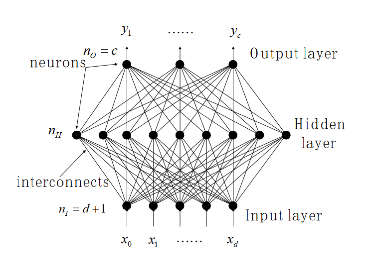

placeholder replace me!

<!-- more -->

# MLPNN 实验报告


## 1. 任务描述

采用什么方法实现一个什么样的任务? 解决了什么问题?

基于MNIST数据集, 设计和实现了一套分类器, 基于**多层感知机MLP模型**，并且尝试使用多种分类的**损失函数**进行测试。

> Based on the MNIST dataset, design and implement MLPNN with two different error functions for classification.

## 2. 数据集描述

采用何种数据集开展实验？

MNIST数据集(kaggle地址)

https://www.kaggle.com/competitions/digit-recognizer

- 基于了手写数字-MNIST数据集

数据集有什么特点？

1. MNIST-手写数字数据集

- 每一张图片都是28 * 28大小的标准图片
- 数据集合的大小比较大, 有42000张手写数字的图片; 测试集合也有28000张
- 数据集合中每种数字的分布比较的均匀

数据集的各项统计量是多少？

- 数据集大小：42000张28*28的数字灰度图片；
- 数据集参数数量：每一张图片的大小都是28*28，数字范围0-9，总计42000个输入训练样本。
- 训练样本中数字的具体的分布如下：



<!--  -->

## 3.方法介绍

### 3.1数据预处理(如有)

1. MNIST数据集

由于输入的没有任何预处理, 会提前观察一下图片的情况

- 例如这里随机打印了25个数字的图片

- 可以观察到手写数字的大致形状和图片的基本属性


### 3.2算法描述

使用的模型是多层感知机MLP

MLP的结构:



- 输入层
- 隐层
- 输出层

特点:
- 输入层大小为输入向量的维数
- 隐层之间的神经元是全连接的
- 隐层神经元的激活函数是非线性的

- 对于网络中的第j个神经元而言, 它所收到的响应为 $net_j = \sum_{i = 1}^d w_{ji} x_i + w_{j0} = \sum_{i = 0}^d w_{ji} x_i = w_j^T \cdot x$

- 因此, 第j个神经元的输出就是$y_j = g(net_j)$

- 对于输出层的第$k$个神经元, 它的信号相应就是$net_k = \sum_{j = 1}^{n_H} w_{kj} y_j + w_{k0} = \sum_{j=0}^{n_H}w_{kj} y_j = w^T_k \cdot y$
- 最终对于标签分类为$k$的输出就是$y_k = f(net_k) = f(w^T_k \cdot y) = f(\sum_{j = 0}^{n_H} w_{kj} f(net_j)) = f(\sum_{j = 0}^{nH} w_{kj} f(\sum_{i = 0}^d w_{ji} x_i))$

- 对于二分类问题而言, $y_k \in \{1, -1\}$

- 对于多分类问题, $y_k = f(net_k) = g_k(x)$


---

MLP采用的不同Loss function

- SSE Sum of Squared Loss

> 物理意义上, 就是实际输出与我们预测的输出之间的方差

$$
E(w) = \frac{1}{2} \sum_{n = 1}^N (y(w, x_n) - t_n)^2
$$

- 概率上的解释: 网络输出给出了一种概率上的分布, 使用概率的好处 1. 可以引入非线性 2. 更多的loss选择

从概率论的角度分析

NN学习到的是一个关于输出变量$t$的概率分布

$P(t|w, x) = N(t| y(w,x), \beta^{-1})$
- 学习到的是一个高斯分布, 期望$\mu = y(w,x)$ 方差为$\beta^{-1}$

假设我们的输入是独立同分布的, 那么对于所有的标签$t=(t_n)_{n=1}^N$
我们列出似然函数

$P(t|w,x,\beta) = \Pi_{n=1}^n P(t_n|w,x_n, \beta)$

$P(t_n | w, x_n, \beta) = \frac{\beta}{\sqrt 2\pi} exp(\frac{-\beta}{2}(t_n - y(w,x_n)^2))$

对数似然函数就是
$L = \sum_{n=1}^N ln(P(t_n | w,x_n,\beta)) =\frac{N}{2}(ln\beta - ln 2\pi) - \frac{\beta}{2}(y(w,x_n) - t_n)^2 $

让对数似然函数最大 **等价于** 让 $\frac{\beta}{2}(y(w,x_n) - t_n)^2$ 最小化,正好就是平方误差SSE最小化!
> 因此从概率角度我们发现概率最大 == 误差最小, 可以转变为一个学习概率分布的问题

--- 

在本次实验中,我们尝试使用的误差函数有:

1. Cross-Entrophy Loss 交叉熵

对于一个二分类问题而言

$t$是输出变量;
- $t = 1$对于$C1$;
- $t = 0$对于$C2$;

网络有单个输出, 输出激活函数是

$$
y = \sigma(a) = \frac{1}{1 + e^{-a}}
$$

那么输出为$t$的概率是:
$$
P(t|X, w) = y(x, W)^t (1 - y(x, W))^{1 - t}
$$

相应的误差函数

$$
E(w) = -\sum_{n = 1}^N\{t_n ln y_n + (1 - t_n) ln(1 - y_n) \}
$$

K分类 输出激活函数为 logistic函数

- 输出标签值为$t$的概率就是
$$
P(t|w,x) = \Pi_{k=1}^K y_k(w,x)^{t_k} (1 - y_k(w, x))^{1 - t_k}
$$

对应的损失函数
$$
E(w) = -\sum_{n=1}^N\sum_{k=1}^K\{t_{nk} ln y_{nk} + (1 - t_{nk}) ln (1 - y_{nk})\}
$$

1-of-K coding
- 不断地用二分类的方式区分标签值为k的概率与非k的概率
- 输出$y_k$的概率公式: $y_k(w,x) = \frac{exp(a_k(w,x))}{\sum_j exp(a_j(w,x))}$


2. MultiLabel Soft-Margin Loss

Multi Labels, 1 vs all, max entropy, (x, y) in (N, C)
多标签, 1对全部的损失函数, 基于的是最大熵模型

具体的计算是
$loss(x, y) = \frac{1}{C}\sum_i y_i * log(\frac{1}{(1 + e^{-x_i}}) + (1 - y_i) * log(\frac{e^{-x_i}}{1 + e^{-x_i}}) $

---

多层感知机的BP算法
- Error BackPropagation

- 从隐藏层到输出层的学习

由于输出层 第$k$个单元的响应为

$net_k = \sum_{j=0}^{n_H} w_{kj} y_j$

所以对于给定的$E(w)$, 关于隐层到输出层系数的梯度

$$
\frac{\partial E}{\partial w_{kj}} = \frac{\partial E}{\partial net_k} 
\frac{\partial net_k}{\partial w_{kj}}
= -\delta_{k} \frac{\partial net_k}{\partial w_{kj}}
$$

- $\delta_k$是第$k$个单元的sensitivity(敏感度)

假设激活函数f是可微分的

$$
\delta_k = \frac{\partial E}{\partial net_k} 
= \frac{\partial E}{\partial y_k} 
\frac{\partial y_k}{\partial net_k} 
=(t_k - y_k) f'(net_k)
$$

(因为这里的误差函数就是SSE)

又因为 $net_k = w_{kj}^T \cdot y_j$
所以$\frac{\partial net_k}{\partial w_{kj}} = y_j$

最终得到隐层-输出层的梯度学习规则

$$
\Delta_{kj} = \eta \delta_k y_j
= \eta (t_k - y_k) f'(net_k) y_j
$$

其中$\eta$是我们定义的学习率

- 从输入层到隐藏层的学习

第$j$个神经元的响应$net_j = \sum_{i=0}^d w_{ji}x_i$

而根据我们的结构, 可以列出以下的梯度关系
$$
\frac{\partial E}{\partial w_{ji}}
= \frac{\partial E}{\partial y_j}
\frac{\partial y_j}{\partial net_j}
\frac{\partial net_j}{\partial w_{ji}}
$$

由于 $\frac{\partial net_j}{\partial w_{ji}} = x_i$
以及 $\frac{\partial y_j}{\partial net_j} = f'(net_j)$

还有误差函数关于输出y的导数
$$
\frac{\partial E}{\partial y_j}
= \frac{\partial}{\partial y_j}[\frac{1}{2}\sum_{k=1}^c (t_k - y_k)^2]
= -\sum_{k=1}^c(t_k-y_k) \frac{\partial y_k}{y_j}
= -\sum_{k=1}^c(t_k-y_k) \frac{\partial y_k}{net_k} \frac{\partial net_k}{y_j}
=  -\sum_{k=1}^c(t_k-y_k) f'(net_k) w_{kj}
$$

类似的我们定义一个隐层单元的敏感度
$\delta_j = f'(net_j) \sum_{k=1}^c w_{kj} \delta_k$

那么对于输入层-隐层的学习规则我们得到

$$
\Delta w_{ji} = \eta \delta_j x_i = \eta f'(net_j) [\sum_{k=1}^c w_{kj}\delta_k] x_i
$$

---

MLP在实际应用中需要考虑的问题

1. 激活函数的选择: 非线性/线性, 单调性, 连续性

2. 隐层的神经元数量 $n_H \to n/10$

3. 初始网络的权重

4. 学习率大小$\eta = 0.1$

5. 权重的衰减

6. 隐层的数量

7. 目标函数的选择

## 4.实验结果分析

### 4.1评价指标

对于MNIST的数据集的数字分类问题，我们使用的评价指标自然是分类的**准确率** $p$ (分类正确个数/总测试样本数)
- 这里既包括了 训练的准确率 $p_{train}$
- 也包括了最终 测试的准确率 $p_{test}$(通过kaggle-submission获得结果)

### 4.2定量评价结果

MNIST识别数字的准确率

实验结果:

多层感知机+不同的损失函数得到的准确率:

- 交叉熵损失: 准确率 $p = 0.97475$
 
- NLL(对数似然损失) negative log likelihood loss: 准确率 $p = 0.97475$


### 4.3可视化结果

可以是算法的实际分类效果图(见上4.2部分)

#### 1.交叉熵损失
(使用sklearn的版本)
> 关于MNIST数据集, 采用基本的MLPNN训练(MLPClassifier, 100个神经元), 学习到的权重分布图(使用sklearn)


训练的代码:


可以看到多层感知机模型是如何通过学习权重实现具体的分类, 例如第3行的第3张图片, 可以很明显看出在'1'数字附近的权重大小有所不同(说明MLP学习到了边界的分布)

**最终得分**
- 准确率为$p_1 = 0.950638$, 达到了一个不错的水平
- 可以看到的是我们的感知机隐层数量只有40个神经元，但是也能够很好的学到特征
- 参数设置为:
1. 隐层大小 $n_H = 40$
2. 学习率 $\eta = 0.2$
3. 梯度下降使用 sgd 随机梯度下降
4. 损失函数 系数$\alpha = 0.0001$

---
(使用torch的版本)

torch的相关网络模型定义:


torch的训练代码:
```python
def train(model, loss_fn, optimizer, train_loader):
    mean_train_losses = []
    mean_valid_losses = []
    valid_acc_list = []
    epochs = 30

    for epoch in range(epochs):
        model.train()

        train_losses = []
        valid_losses = []
        for i, (images, labels) in enumerate(train_loader):
            optimizer.zero_grad()
            
            outputs = model(images)
            loss = loss_fn(outputs, labels)
            loss.backward()
            optimizer.step()

            train_losses.append(loss.item())

            if (i * 128) % (128 * 100) == 0:
                print(f'{i * 128} / 50000')

        model.eval()
        correct = 0
        total = 0
        with torch.no_grad():
            for i, (images, labels) in enumerate(valid_loader):
                outputs = model(images)
                loss = loss_fn(outputs, labels)

                valid_losses.append(loss.item())

                _, predicted = torch.max(outputs.data, 1)
                correct += (predicted == labels).sum().item()
                total += labels.size(0)

        mean_train_losses.append(np.mean(train_losses))
        mean_valid_losses.append(np.mean(valid_losses))

        accuracy = 100*correct/total
        valid_acc_list.append(accuracy)
        print('epoch : {}, train loss : {:.4f}, valid loss : {:.4f}, valid acc : {:.2f}%'\
             .format(epoch+1, np.mean(train_losses), np.mean(valid_losses), accuracy))
    return mean_train_losses, mean_valid_losses, valid_acc_list
```
> MNIST使用交叉熵(Cross-Entropy)作为损失函数时的训练准确率曲线(使用torch)

torch的测试:


可以看到很快网络就收敛, 损失很快收敛到一个较低的水平。


具体的测试过程中 我们可以看到一个步长(epoch)就使得我们的感知机在训练集上几乎学到了所有特征, 获得了90%以上的准确率
- 训练集上的准确率$p_{train} = 0.9686$

**最终结果**

- 我们的多层感知机(使用交叉熵损失)在测试集上的准确率$p = 0.97475$ 达到了一个很高的水平


---

#### 2.MultiLabel SoftMargin Loss

- 多标签-软间隔损失的定义


- 可以看到实际上类似于交叉熵, 但这里的损失函数, 基于的是最大熵模型

- 1 vs k的想法的一个具体应用

相应的代码:

```python
new_model = MLP()
loss_fn = nn.MultiLabelSoftMarginLoss()
optimizer = torch.optim.Adam(new_model.parameters(), lr=0.001)

## 使用 MultiLabelSoftMarginLoss 损失的测试
mean_train_losses, mean_valid_losses, valid_acc_list = modified_train(new_model, loss_fn, optimizer, train_loader)
```

训练的过程:


- 训练的最终准确率$p_{train} = 0.9762$


**最终结果**

- 我们的多层感知机(使用多标签软间隔损失)在测试集上的准确率$p_{test} = 0.97032$ 也达到了一个很高的水平


## 5.总结 
    比较不同方法的优缺点等。

多层感知机模型在数字分类问题上的表现都很不错，即使是最简单的单隐层模型；MLP的一个优点就是十分灵活，可以简单也可以复杂。

实验中我们测试了不同隐层大小对于分类结果的影响，发现当大小较小时相对而言效果总是稍微差于更大的网络，但是差距并不是很大。

对于不同的损失函数而言，可以发现不同的loss-function，即使都是基于最大似然估计的概率分布，目标都是去最大化这个似然函数，训练的效果也会略有不同。而如何选择一个合适的loss-function对于我们的模型效果也是很重要的。
